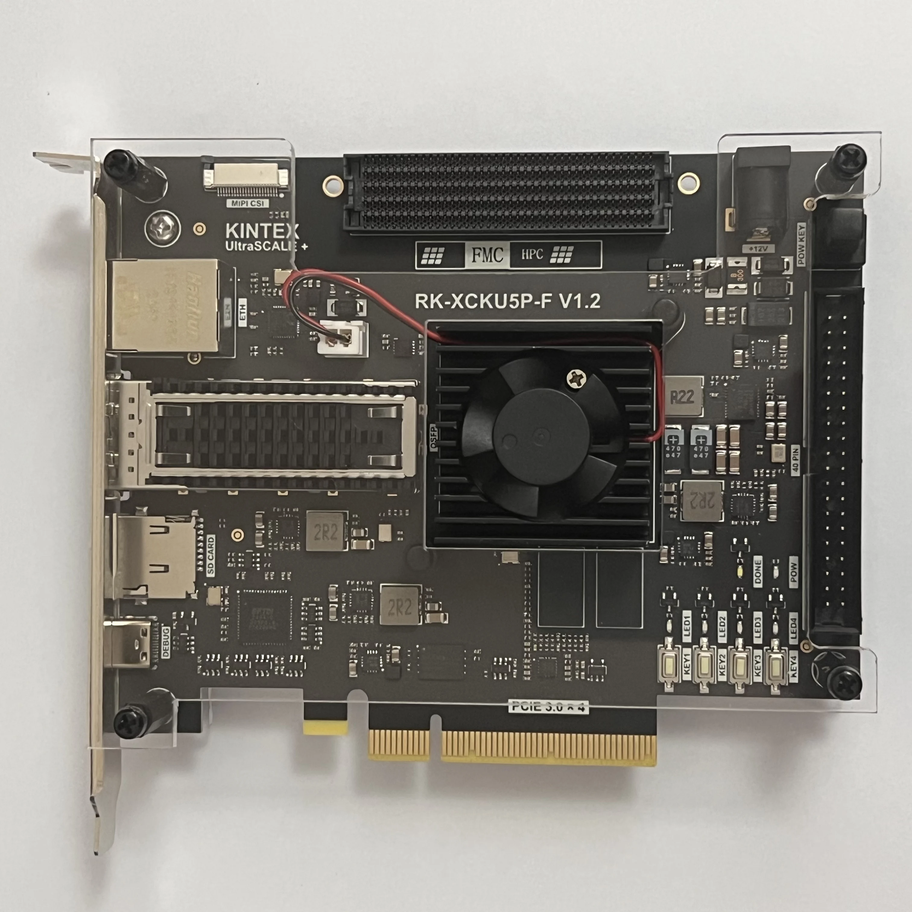

# Collateral for an RK-XCKU5P-F V1.2 XCKU5P dev board

This *unbranded* XCKU5P development board is widely available on eBay
and can be found on AliExpress.  The collateral isn't easy to find so
I'm making it available here.  Note, it was originally distributed as
a Zip file with Zip files inside (which had Zip files etc).  I
unpacked everything are reorganized it slightly, but have not renamed
any files.

## The Manual
[RK-XCKU5P-F V1.2.pdf](RK-XCKU5P-F V1.2.pdf)

Some relevant facts about this board (which as of this writing I don't
not have):
- FPGA: Xilinx XCKU5P-2
- DDR4: 2 GiB (2 x MT40A512M16LY-0625E @ 2666 Mbps) [1]
- QSPI
- SDcard
- PCIe 3.0 x4
- QSFP28
- Ethernet (GbE)
- MIPI
- 40PIN IO
- FMC HPC
- LEDs, buttons

[1] Note, BG[1] isn't routed, so swapping them out for TwinDie devices
is more challenging.
